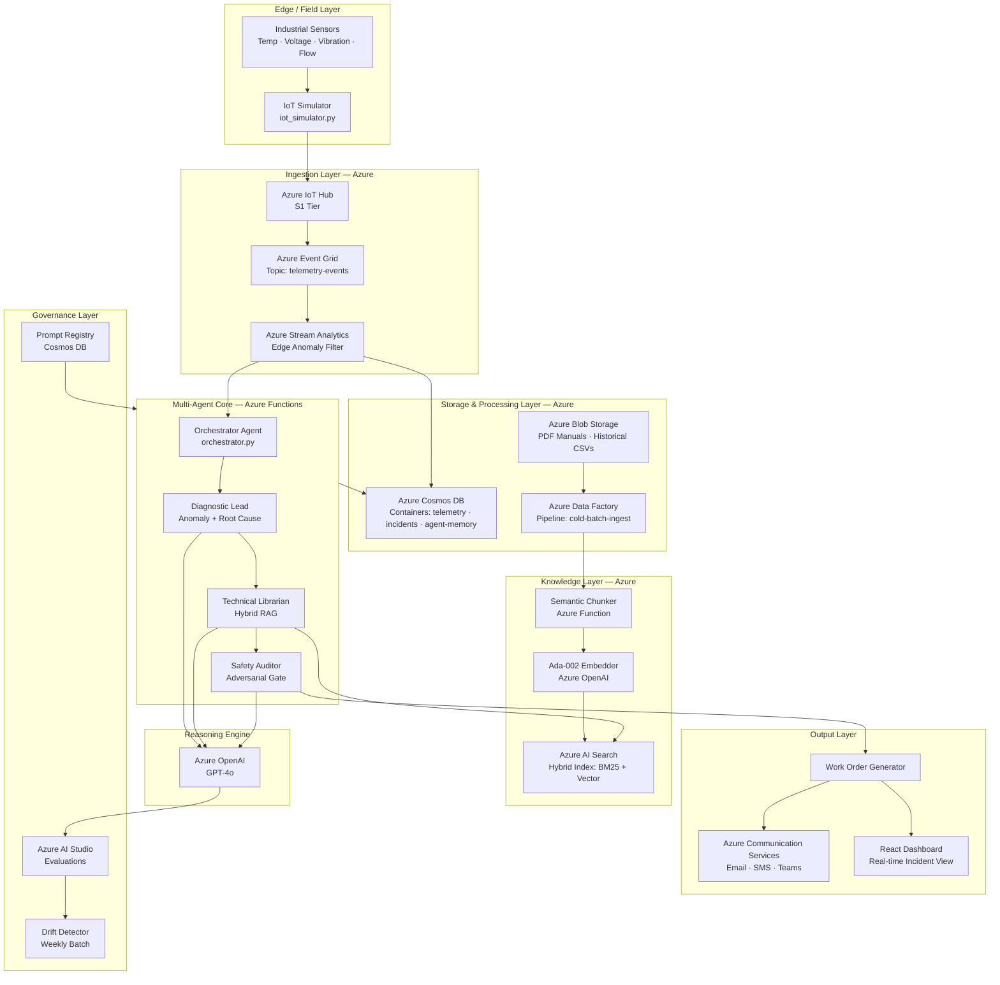
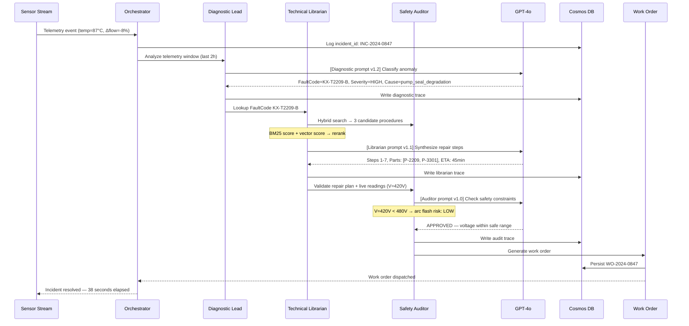
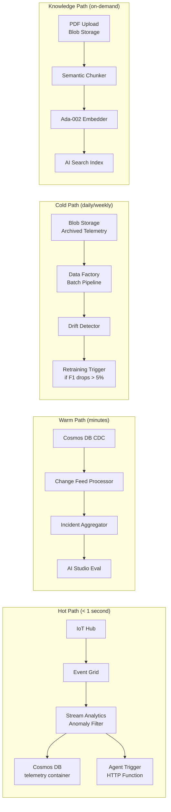
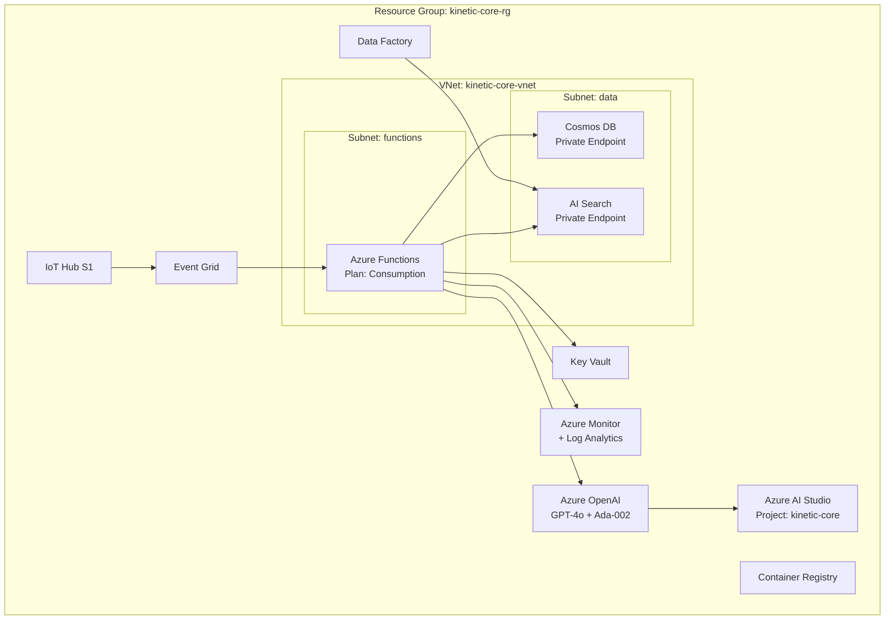
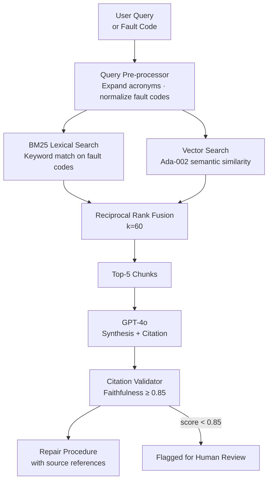
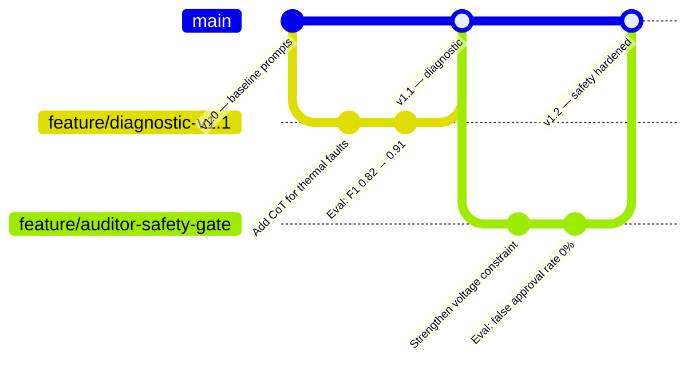

# Kinetic-Core — System Architecture

## 1. High-Level System Flow

---

## 2. Agent Interaction Sequence

---

## 3. Data Flow Architecture

---

## 4. Infrastructure Architecture

---

## 5. Hybrid RAG Architecture

---

## 6. Prompt Versioning Lifecycle

---

## 7. Security Architecture

| Layer | Control | Implementation |
|---|---|---|
| **Network** | Private endpoints for Cosmos DB + AI Search | VNet integration |
| **Identity** | Managed Identity for all Azure Functions | No stored credentials |
| **Secrets** | All API keys in Key Vault | Key Vault references in Function App settings |
| **Data** | Cosmos DB encryption at rest | Azure-managed keys (CMK roadmap) |
| **API** | JWT validation on all endpoints | Azure AD B2C |
| **Audit** | All agent reasoning traces stored immutably | Cosmos DB time-to-live disabled for audit container |

---

## 8. Scalability & Cost Model

| Load | IoT Messages/sec | Agent Invocations/day | Estimated Azure Cost/month |
|---|---|---|---|
| **Dev** | 1 | 50 | ~$85 |
| **Pilot (1 facility)** | 100 | 500 | ~$420 |
| **Production (10 facilities)** | 1,000 | 5,000 | ~$2,100 |
| **Enterprise (100 facilities)** | 10,000 | 50,000 | ~$9,800 |

*GPT-4o invocations dominate cost; Stream Analytics edge filter reduces agent calls by ~85%.*
